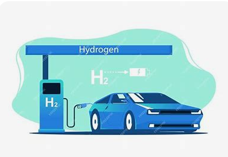

# Hydrogen-Fuel-Car-Game
Our team created a Python-based game to support Global Edmonton's 1000 Hydrogen Vehicle Challenge.

The game educates players on hydrogen fuel technology and its environmental benefits
by simulating the operation of hydrogen-powered vehicles.

It aims to raise awareness and inspire adoption of sustainable, clean transportation.

**The `Hydrogen_Project2.py` script is a Python-based game developed using the Pygame library.**
Here is a summary of its main components and functionalities:

1. **Initialization and Setup**:
   - Imports necessary libraries (`pygame`, `random`, `os`).
   - Sets the working directory and initializes Pygame.
   - Loads background music and sets constants for screen dimensions, colors, and other parameters.

2. **Image and Sound Loading**:
   - Defines a function to load images and loads various game assets (coins, fuel cells, backgrounds, etc.).
   - Loads sound effects for different in-game actions (collecting coins and fuel cells).

3. **Game Classes**:
   - `FuelCell` and `FuelStation` classes represent in-game objects with attributes and methods for their behavior.

4. **Game Functions**:
   - Functions to spawn coins and fuel cells at random positions.
   - Functions to draw the start menu, level selection screen, and display congratulations messages.

5. **Main Game Loop**:
   - `main(level_index)`: The core function that runs the game for a specific level, handling game logic, player input, and rendering.
   - Handles background movement, player controls, collision detection, and score updates.
   - Spawns and updates fuel stations based on player progress.

6. **Game Loop and Level Selection**:
   - `game_loop()`: Manages the start menu and transitions to level selection.
   - `level_selection()`: Handles level selection and starts the game at the chosen level.

7. **Entry Point**:
   - The script starts the game by calling `game_loop()` if executed as the main module.

The game simulates the operation of hydrogen-powered vehicles, educating players on hydrogen fuel technology and its environmental benefits.
